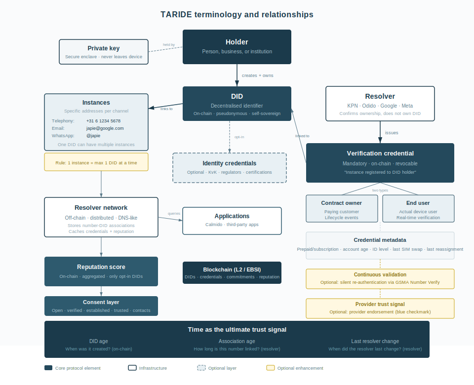
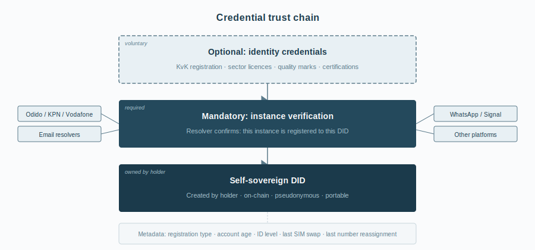
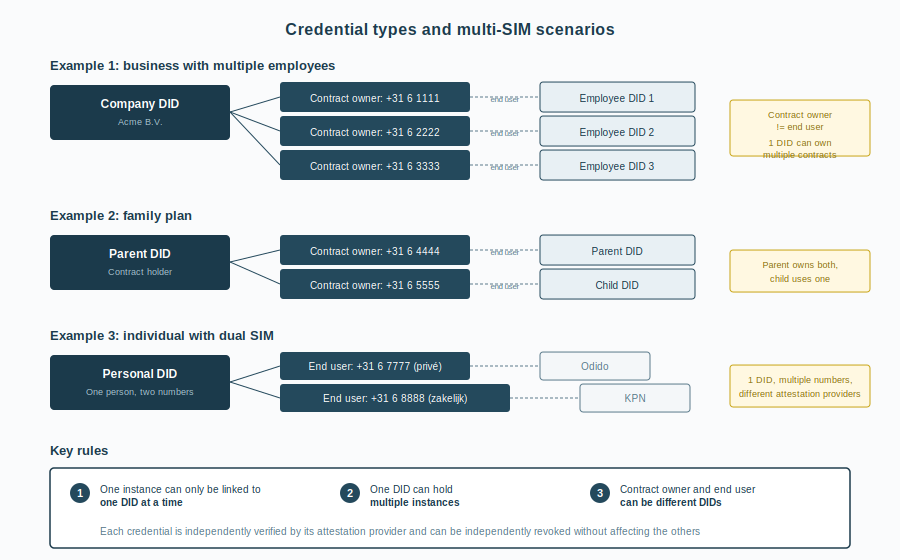
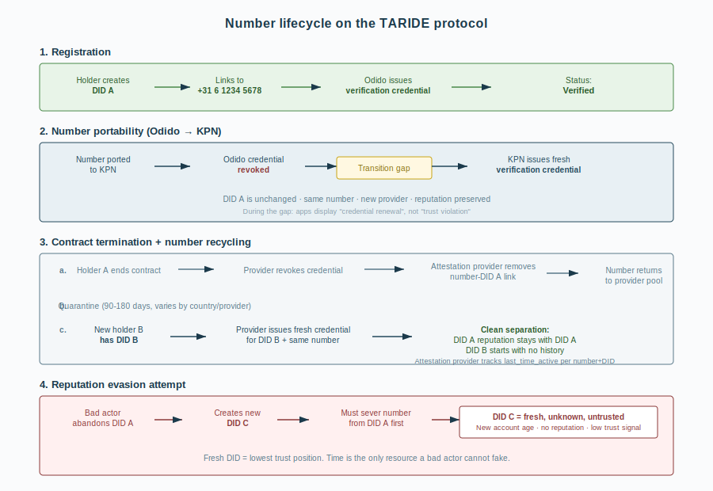
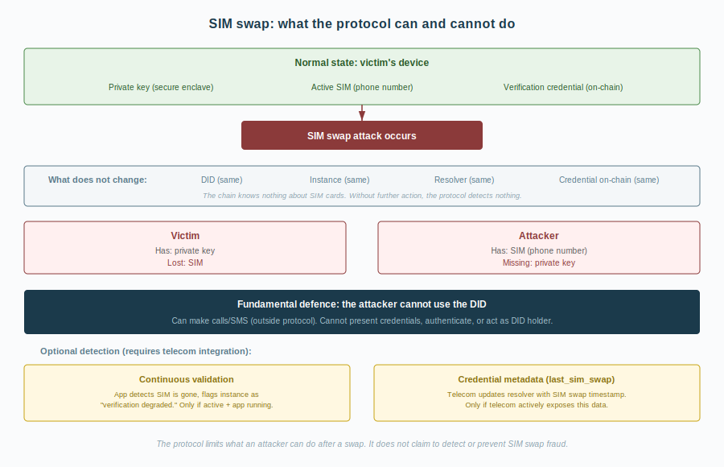
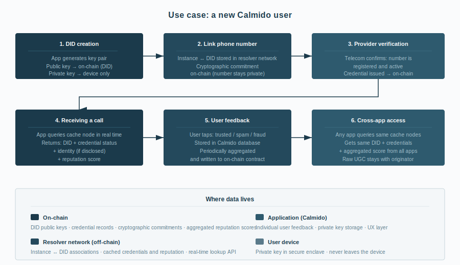
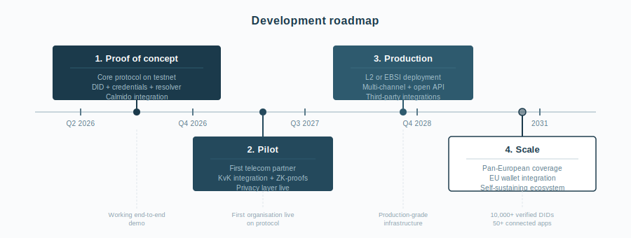
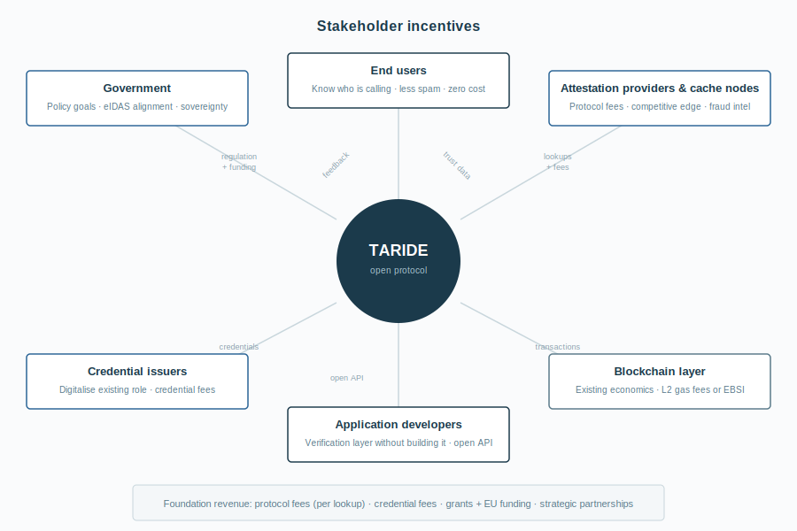

**TARIDE**

Trust and Authentication Registry for Integrity in Digital Europe

*An open, European protocol for trust without identification*

Foundation overview · v0.4

March 2026

[taride.org](https://taride.org/)

Published under Creative Commons Attribution 4.0 International (CC BY 4.0)

# Executive summary

Trust in digital communications is collapsing. In the Netherlands, an estimated €1.75 billion was lost to scams in 2024. One in seven citizens was affected. The Odido data breach in February 2026 - exposing 6.2 million customer records - demonstrated that centralised telecom infrastructure is itself a target. Meanwhile, AI-generated voice cloning and synthetic identities are making traditional defences (call blockers, spam filters, static databases) increasingly ineffective.

TARIDE - the Trust and Authentication Registry for Integrity in Digital Europe - is an open protocol that solves this at the infrastructure level. It enables any party to verify that a communication comes from a registered source, without requiring or revealing personal information.

**The core principle: anonymity by default, identification by choice.**
This is TARIDE’s fundamental differentiator. Existing solutions (STIR/SHAKEN, Truecaller, Hiya) and industry proposals (GSMA’s eIDAS 2.0 framework) require or incentivise identification as a precondition for trust. TARIDE inverts this: verification is the default, identification is optional. A private individual can prove their phone number is registered without disclosing their name. A business can choose to add its KvK registration, banking licence, or other credentials. The user controls how far along the spectrum from anonymous to fully identified they go.

## Five protocol layers

The protocol operates through five layers. The **registration layer** establishes self-sovereign decentralised identifiers (DIDs). The **verification layer** enables service providers to confirm ownership of communication instances (phone numbers, email addresses, messaging handles) without revealing personal data. The **reputation layer** aggregates community feedback on opted-in organisations. The **consent layer** lets recipients define in advance who can reach them - from open to verified to contacts only. The **resolver network** serves all of this in real time, with sub-500ms lookups suitable for incoming call scenarios.

## Time as trust

The protocol’s most powerful anti-spam mechanism is unforgeable: time. Two independent timestamps — DID age and instance-DID association age — form a trust profile that no attacker can fake. A separate metadata field (last resolver change) flags recent portability or provider switches. Creating a new identity is free. Building trust takes months. This makes spam economically unattractive without requiring identification.

## Why a foundation

Trust infrastructure cannot be owned by a commercial entity. TARIDE is structured as a Dutch foundation: open-source, mission-protected, multi-stakeholder governed and aligned with European values. The protocol is designed to complement eIDAS 2.0, EBSI, and the European Digital Identity Wallet.

## Roadmap

Proof of concept in Q2-Q3 2026 (core protocol on Ethereum testnet, integrated in the Calmido app, acquisition of first resolver node operators). Pilot with a first telecom partner and KvK integration in Q4 2026-Q2 2027. Production deployment on L2 or EBSI in Q3 2027-Q4 2028. Pan-European scale by 2029-2031.

*The rest of this document describes the protocol architecture, use cases, governance, incentive structure, and partnership strategy in detail.*

# The problem

Digital deception has fundamentally undermined trust in communications. In the Netherlands alone, an estimated €1.75 billion was lost to scams in 2024, affecting one in seven citizens \[1\]. Across Europe, consumers receive between two and fifteen unwanted calls per week \[2\], and 92% now assume that unidentified calls are fraudulent \[3\]. Nearly half of all calls from unknown numbers go unanswered, even when the caller is legitimate. In the first quarter of 2025, Dutch fraud reports tripled compared to the same period a year earlier \[4\]. Among victims, more than 40% report diminished trust in others, and 25% say they feel less safe \[5\].

The emergence of generative AI is accelerating this erosion. Voice cloning, synthetic identities, and AI-generated social engineering attacks are becoming increasingly sophisticated and accessible. In the Netherlands, AI-driven voice impersonation scams have been a primary driver behind the surge in fraudulent calls \[4\]. Existing solutions - call blockers, spam filters, static databases - address symptoms rather than root causes. They focus on content rather than context, and they cannot establish trust.

The vulnerability is not limited to end users. In February 2026, Odido - the largest mobile provider in the Netherlands - suffered a data breach exposing personal data of 6.2 million customers, including names, addresses, bank account numbers, and identification documents \[7\]. The attack targeted a customer contact system, demonstrating that centralised telecom databases are themselves high-value targets. The stolen data increases the risk of precisely the kind of social engineering and SIM swap attacks that the current infrastructure cannot defend against.

What is missing is infrastructure: an open, decentralised layer that can authenticate the identity behind a communication before it reaches the recipient. Not a product. A protocol.

# Why this doesn’t exist yet

Parts of this problem have been addressed before. STIR/SHAKEN, mandated for US carriers since 2021, verifies that a caller’s number is authentic. Truecaller and Hiya offer caller identification and spam detection to hundreds of millions of users. The W3C standards for decentralised identifiers (DIDs) and verifiable credentials are mature and adopted. The technical building blocks exist. What is missing is the complete picture: an open, decentralised, European trust layer that combines identity verification, credential issuance, and community reputation into a single protocol. There are four structural reasons why this has not yet been built.

**The regulatory framework was not ready.** eIDAS 2.0, which provides the legal basis for verifiable credentials across Europe, was adopted in 2024. The European Digital Identity Wallet that accompanies it is expected to roll out in 2026-2027. Without this regulatory infrastructure, there was no standardised European identity framework to build on.

**It is a coordination problem.** A trust protocol requires simultaneous participation from telecom operators, government agencies, chambers of commerce, and application developers. None of these parties has an individual incentive to initiate such a system. An independent foundation is the natural coordinator, but someone has to establish it.

**It suffers from a cold-start problem.** A verification protocol is only useful if parties register on it and applications query it. Neither side moves if the other is empty. Breaking this deadlock requires three parallel moves: a consumer application (Calmido) that provides the first users and demonstrates demand; at least one telecom partner that commits to operating a resolver node and issuing credentials; and a public communications strategy that frames the protocol as an industry initiative rather than a single company’s project. The telecom partner is the critical dependency - without a resolver, the protocol cannot issue credentials, and without credentials, the app has nothing to display.

**It does not fit conventional business models.** An open protocol governed by a foundation is not attractive to venture capital. The commercial solutions that do exist - Truecaller, Hiya - generate revenue by collecting and monetising user contact data, which is precisely the model that a trust protocol should avoid. There was no financial incentive to build it the right way.

The conditions have now converged: the regulation (eIDAS 2.0), the technology (DIDs, verifiable credentials, zero-knowledge proofs), the urgency (AI-driven fraud), and a party willing to build it from a foundation model rather than a commercial one.

# What TARIDE is

TARIDE - the Trust and Authentication Registry for Integrity in Digital Europe - is a non-profit foundation establishing an open protocol for verified and anonymous digital communications across Europe.

The core principle is simple: when you receive a call, message, or notification, the protocol can confirm that the sender’s contact point (the specific phone number, email address, or messaging handle) is registered to a known account at a provider - without revealing who the sender is. Anonymity is the default. Identification is optional, and always under the control of the sender.

Any party - an individual, a business, a government agency - can register a decentralised identifier (DID) and link their communication channels to it. Their telecom or service provider confirms ownership of those channels without revealing personal information. The protocol guarantees this confirmation. It does not require or store names, addresses, or any personal data. A business that wants to be recognised by name can choose to add identity credentials. A private individual who simply wants their number confirmed as registered does not have to identify themselves at all.

TARIDE does not build consumer applications. It builds the infrastructure layer that applications use. The foundation develops and maintains:

- **An open-source verification protocol** based on decentralised
  identifiers (DIDs) and verifiable credentials, aligned with W3C
  standards and the European eIDAS 2.0 framework. Anonymity by default,
  identification by choice.

- **A verification registry** where resolvers (telecom operators, email
  providers, messaging platforms) confirm that a specific instance is
  registered to the DID holder, without disclosing the holder’s
  identity.

- **An optional identity layer** where DID holders who choose to be
  identifiable can add credentials from trusted issuers (chambers of
  commerce, regulators, certification bodies).

- **A reputation layer** where end users provide feedback on
  communications from DIDs that opt into visibility. The protocol scores
  communication channels, not people.

- **A consent layer** where DID holders define per channel under which
  conditions communication is welcome - from open to verified to
  contacts only. The recipient controls who can reach them.

- **A resolver network** that enables real-time lookup of verification,
  identity, reputation, and consent data by any connected application,
  with response times suitable for incoming call scenarios (sub-500
  milliseconds).

The protocol is designed to be communication-channel agnostic. While the initial implementation focuses on telephony - where the problem is most acute and measurable - the architecture supports extension to email, messaging, and other digital communication channels.

# Why a foundation

Trust infrastructure cannot be owned by a single commercial entity. If the verification layer for digital communications is controlled by a company driven by profit maximisation, the incentives will eventually diverge from the public interest. This is not a theoretical concern - it is the pattern that has played out across the technology industry over the past two decades.

TARIDE is structured as a foundation to ensure that the protocol remains:

- **Open and non-proprietary.** The protocol specifications and
  reference implementations are open-source. No single party can
  restrict access or extract rent from the trust layer.

- **Mission-protected.** The foundation’s governing documents prevent
  acquisition, sale, or deviation from its core mission. This protection
  is structural, not dependent on the goodwill of current leadership.

- **Multi-stakeholder governed.** Governance includes representatives
  from civil society, academia, industry, and government. No single
  interest group controls decision-making.

- **Aligned with European values.** Anonymity by default, privacy by
  design, data sovereignty, and user autonomy are architectural
  principles, not afterthoughts. The protocol does not require personal
  identification. The foundation is established in the Netherlands,
  operating under European law and governance norms.

This structure draws on precedents set by organisations such as the Signal Foundation (secure messaging), Mozilla Foundation (open internet), and Ecosia (environmental search). Each demonstrates that critical digital infrastructure can be developed and sustained outside conventional venture-capital models.

# How the protocol works

The TARIDE protocol operates through *five* interconnected layers. Before describing them, three core concepts require definition.

**Communication channel.** A type of communication: telephony, email, WhatsApp, Signal, SMS, or any other medium. The protocol is channel-agnostic and treats all channels through the same verification architecture.

**Instance.** A specific contact point within a channel. +31 6 1234 5678 is an instance within the telephony channel. japie@google.com is an instance within the email channel. @japie is an instance within WhatsApp. The protocol operates on instances, not on channels abstractly.

**Resolver.** The provider that acknowledges the coupling between a DID and a specific instance. For a phone number, this is the telecom provider (KPN, Odido, Vodafone). For an email address, the email provider. For a messaging handle, the messaging platform. The resolver confirms that the instance is registered to the DID holder. When a user ports their number from Odido to KPN, the DID stays the same, the instance (phone number) stays the same, but the resolver changes from Odido to KPN.

*Reputation attaches to the DID and the instance, not to the resolver.*
A phone number that is ported from one provider to another retains its reputation because the DID and the instance are unchanged. Only the resolver - the party confirming ownership - changes.

*Diagram: terminology and relationships*

## Registration layer

Any party - individual, business, or institution - creates their own decentralised identifier (DID). This involves generating a cryptographic key pair: the public key is registered on a distributed ledger (a shared, tamper-resistant record maintained across a network of independent systems, commonly known as a blockchain), while the private key remains solely with the holder. The DID belongs to its creator, not to any provider, platform, or authority. It is pseudonymous by nature: a cryptographic identifier with no inherent link to a name, address, or any personal information.

In practice, end users do not interact with cryptography directly. A connected application - such as Calmido - initiates the creation of a DID, manages the keys in the background, and registers the coupling between the DID, the user’s phone number, and the resolver that acknowledges this association. The user experience is comparable to setting up a messaging app: seamless, with no wallets, seed phrases, or blockchain interactions visible. When the EU Digital Identity Wallet becomes available (expected 2026-2027), it can serve the same role, making the DID portable across applications.

The DID holder links instances of their communication channels - phone numbers, email addresses, messaging handles - to their DID. These associations are maintained off-chain in the resolver network. The resolver for each instance (the telecom provider for a phone number, the email provider for an email address) issues a verification credential that confirms the instance is registered to the DID holder, without revealing personal information or controlling the DID. If a user switches from Odido to KPN, the DID stays the same, the phone number (instance) stays the same, but the resolver changes: Odido’s credential is revoked and KPN issues a fresh one. The holder’s identity on the protocol persists independently of any single provider relationship.

The DID standard (W3C) ensures interoperability with other identity systems, including the European Digital Identity Wallet under eIDAS 2.0. The protocol is designed with cryptographic agility, enabling migration to post-quantum signature schemes as these standards mature.

## Verification layer

Credentials are issued by trusted institutions and cryptographically signed, time-bound, and revocable. They come in two categories, reflecting the protocol’s principle of anonymity by default.

*Diagram: credential trust chain*

### Mandatory: instance verification

The resolver for each instance issues a verification credential confirming that the instance is registered to the DID holder. The resolver confirms ownership but does not own or control the DID itself. For telephony, the telecom provider (Odido, KPN, Vodafone) confirms that a specific phone number is registered to a specific account. For email, the email provider confirms the address. For messaging, the platform confirms the handle. This is the foundational credential: without it, any party could claim ownership of any instance. No personal information is disclosed in this process - the credential confirms registration, not identity.

For telephony, the GSMA has proposed a framework for mobile numbers as verifiable credentials within eIDAS 2.0 wallets \[6\], distinguishing between two types of attestation that the TARIDE protocol adopts:

- **Contract owner credential.** Confirms that the DID holder is the
  registered contract owner of the number. This is the strongest form of
  verification: the provider attests that this person or organisation is
  the paying customer. This credential is relevant for lifecycle events
  such as SIM replacement, number porting, and contract changes.

- **End user credential.** Confirms that the DID holder is the actual
  user of the device and number, which may differ from the contract
  owner (for example, in family plans or corporate subscriptions). This
  credential is relevant for real-time verification when sharing the
  number with other parties. It can be silently re-authenticated with
  the mobile network whenever the credential is presented, providing
  real-time proof of possession without user interaction.

The distinction matters in practice. A company may own fifty phone numbers (contract owner), but each number is used by a different employee (end user). A parent may hold the contract for a family plan, while each family member is the end user of their own number. The protocol supports both credential types independently, allowing applications to determine the appropriate level of verification for their use case.

**Multiple credentials per DID.** A single DID can hold multiple contract owner credentials (for example, a business owner with contracts at multiple providers or multiple subscriptions under one name) and multiple end user credentials (for example, a person with a dual-SIM device or separate numbers for personal and professional use). Modern handsets commonly support multiple SIMs, and the protocol reflects this reality. Each number-DID association is independently verified by its respective provider, and each credential can be independently revoked without affecting the others.

*Diagram: credential types and multi-SIM scenarios*

### Continuous validation

A static credential confirms that a number was verified at a specific point in time. For higher-assurance scenarios, the protocol supports continuous validation through silent re-authentication: each time the credential is presented or a communication occurs, the application can verify in real time with the mobile network that the number is still active and still associated with the same SIM card. This uses existing telecom infrastructure (GSMA Number Verify / CAMARA standards) and happens invisibly to the user - no codes, no pop-ups, no interaction required. The MNO effectively provides an ongoing, real-time attestation rather than a one-time snapshot.

Silent re-authentication provides a strong defence against SIM swap attacks: even if an attacker obtains a replacement SIM, the re-authentication will fail against the DID holder’s original credential. It requires an active network connection and telecom integration, making it an optional enhancement rather than a protocol requirement. For the proof of concept, static credentials with periodic renewal are sufficient.

### Optional: identity and attestations

DID holders who choose to be identifiable can add further credentials. A business can add a chamber of commerce (KvK) credential confirming its legal identity and registration number. Sector regulators, certification bodies, or other trusted parties can attest to financial licences, healthcare registrations, quality marks, or compliance certifications. These credentials are entirely voluntary. A private individual who only wants to confirm that their number is registered to them never has to identify themselves.

The telecom provider occupies a unique position in this architecture. It is the only party that can confirm that a number is registered to the party claiming it. But it does not own or control the DID. If the holder switches provider, the DID persists. In cases of abuse, the provider retains the ability - and the legal obligation - to disclose subscriber information to authorised government agencies upon lawful request. This makes telecom partnerships foundational to the protocol’s operation.

### Revocation and enforcement

Credentials can be revoked at any time by the resolver that issued them. If a telecom provider receives abuse reports or a legal order, it can revoke the verification credential. This revocation propagates through the network in real time: all connected applications immediately see that the instance is no longer verified. This is significantly more effective than the current situation, where each spam filter or call-blocking app must independently learn that a number is untrustworthy. The protocol adds a layer of proactive trust signalling; it does not alter the existing legal framework for reactive enforcement.

*The verification layer handles several operational scenarios in detail - number portability, SIM swap fraud, prepaid numbers, number recycling, and reputation evasion. These are described in the [Protocol details chapter](#_Protocol_details) below.*

## Reputation layer

End users contribute feedback on communications from DIDs that have opted into visibility - typically businesses and institutions that want to build a public trust profile. The reputation layer creates a decentralised quality signal comparable to consumer review systems. It operates exclusively on DIDs with identity credentials: anonymous DIDs that have only a verification credential are not subject to reputation scoring. Reputation attaches to the combination of DID and instance, not to the resolver. No reputation data is collected about individuals. Users who submit feedback remain anonymous, and no user profiles, behavioural scores, or personal ratings exist within the system. Spam detection for unverified or anonymous instances is an application-layer function, outside the scope of the protocol. The aggregation algorithm weights recent feedback more heavily and includes safeguards against coordinated manipulation.

### Reputation evasion

A self-sovereign protocol cannot prevent someone from creating a new DID. A party with a poor reputation could abandon their DID, create a new one, and start over. As described in the sybil resistance section above, the protocol’s primary defence is time: DID age and association age together form a trust profile that cannot be faked. A fresh DID with a fresh instance resets both clocks and starts at the lowest trust position on the network. Combined with the one-instance-one-DID constraint, optional provider trust signals, consent-based filtering, and application-level safeguards, the protocol makes reputation evasion technically possible but economically unattractive.

## Consent layer

The previous layers are reactive: a communication arrives, the protocol provides context, and the recipient decides. The consent layer inverts this dynamic. The recipient defines in advance under which conditions communication is welcome. The protocol shifts from an information system to a filtering layer.

This is consistent with the core philosophy: the DID is self-sovereign, the holder defines their own rules. Consent is the logical extension - you control not only who you are on the protocol, but also who can reach you.

### Consent levels

Per communication channel (telephony, email, messaging), a DID holder can define a consent level. Examples:

- **Open.** Accept all communication. This is the default and mirrors
  how telephony works today.

- **Verified.** Accept only from DIDs with an active verification
  credential. The sender’s number must be confirmed by their provider.

- **Established.** Accept only from DIDs that meet a minimum age
  threshold (for example: DID older than 6 months, number-DID
  association older than 3 months). Filters out freshly created
  identities.

- **Trusted.** Accept only from DIDs with a positive reputation score or
  identity credentials (KvK, provider trust signal).

- **Contacts only.** Accept only from DIDs in the holder’s contact list.
  Maximum restriction.

Each channel can have a different setting. A user might set their phone number to “verified”, their email to “open”, and their WhatsApp to “contacts only.” This reflects how people already manage their reachability in practice - you share your mobile number selectively but your email more broadly.

### Where consent lives

Consent preferences are stored as part of the DID profile in the resolver. They are not on-chain (that would require a transaction for every change). When an application initiates outbound communication, it can query the resolver for the recipient’s consent preferences before or during the call. The resolver responds with the consent level for that channel, and the application acts accordingly.

### Enforcement is at the application layer

The protocol stores and serves consent preferences. It does not block communication. The telecom network establishes the connection regardless - TARIDE is not in the signalling path of a phone call. It is the recipient’s application that enforces consent: if an incoming call does not meet the holder’s preferences, the app can suppress the ring and show a notification (“Verified number, but does not meet your preferences”), or the sender’s application can warn in advance (“This recipient only accepts communication from verified DIDs”). The user always retains the final decision.

### Impact on spam economics

Consent transforms the anti-spam argument from passive to active. Without consent, the protocol shows a spammer as untrustworthy after the fact. With consent, a significant portion of recipients becomes unreachable for unverified or unestablished DIDs in the first place. If 60% of users set their telephony to “verified” or “established,” the effective reach of a fresh spam DID drops to 40% of the network. The cost per successful spam interaction rises proportionally. Combined with the time-as-trust mechanism, consent creates a double barrier: you need time to build trust, and you need trust to reach people.

An important design consideration: consent should not make the protocol unusable for legitimate first-contact scenarios (a new business calling a customer, a healthcare provider reaching out). The recommended default is “verified” rather than “contacts only,” and applications should mark non-compliant communication rather than silently blocking it. The recipient always sees what was filtered and why and can override at any time.

## Resolver layer

A distributed resolver network maintains the associations between DIDs and their instances, and serves verification, identity, reputation, and consent data to connected applications in real time. While identity credentials and reputation scores are anchored on-chain, the mapping between instances and DIDs is held within the resolver network, secured by on-chain cryptographic commitments that allow any party to verify resolver integrity without exposing sensitive data. Applications query the resolver when a communication arrives and receive a trust profile within milliseconds. The resolver architecture follows the DNS model: multiple independent operators run resolver nodes, ensuring resilience and preventing single points of failure or control.

*Diagram: protocol architecture*

# Protocol details

The following sections describe how the protocol handles specific scenarios: number portability, SIM swap fraud, prepaid numbers, number recycling, and reputation evasion. These are operational details that build on the five protocol layers described above.

*Diagram: number lifecycle*

## Number portability

Because the DID is self-sovereign, number portability does not affect the holder’s identity on the protocol. When a user switches from Odido to KPN, the DID remains unchanged and the instance (the phone number) remains unchanged. What changes is the resolver: Odido is no longer the party confirming ownership, KPN is. Odido’s verification credential is revoked, KPN issues a fresh one. Reputation is preserved because it is bound to the DID and the instance, not to the resolver.

During the transition, there is a brief window in which the number’s verification status is in flux. Applications connected to the protocol display this as a credential renewal, not as a trust violation. The duration of this window depends on the level of integration with the telecom provider: in a fully automated scenario, the new credential is issued within minutes of the port completing.

## SIM swap fraud

SIM swap fraud - where an attacker convinces a telecom provider to transfer a victim’s number to a new SIM card - is a well-documented and growing problem. The protocol does not prevent SIM swaps from occurring (that is a telecom-internal security issue). And it is important to be precise about what the protocol can and cannot detect.

*Diagram: SIM swap defence layers*

## What does not change

After a SIM swap, the DID is the same, the instance (phone number) is the same, the resolver (telecom) is the same, and the verification credential on-chain is the same. The chain knows nothing about SIM cards. If nothing else happens, the protocol does not automatically detect that a SIM swap has occurred.

## What does change

The private key and the SIM are now on different devices. Before the swap, the victim’s device held both the private key (in the secure enclave) and the SIM (with the number). After the swap, the victim still has the private key but no longer has the SIM. The attacker has the SIM but not the private key. This separation has two consequences.

**The fundamental defence: the attacker cannot use the DID.** The attacker can use the phone number to make calls and receive SMS (outside the protocol), but cannot perform any action that requires the private key: presenting the verification credential, authenticating on the protocol, or interacting with applications as the DID holder. The protocol does not protect the phone number - that is telecom-internal. It protects the DID and everything attached to it.

## Optional detection mechanisms

Two mechanisms can make a SIM swap visible on the protocol, but neither is automatic or guaranteed. Both require active participation from the telecom provider.

**Continuous validation.** If active, the app on the victim’s device periodically re-authenticates with the mobile network. After a SIM swap, this re-authentication fails (the SIM is gone). The app can then flag the instance as “verification degraded.” The attacker, meanwhile, cannot re-authenticate from the protocol’s perspective because they lack the private key. The result: the instance becomes unverified for both parties. However, this only works if continuous validation is enabled and the victim’s app is still running.

**Credential metadata (last_sim_swap).** The telecom provider knows when a SIM swap has occurred. If the provider actively updates this information in the resolver, applications can see: “the SIM of this instance was changed 3 minutes ago.” That is a strong signal. But it requires the telecom to expose this data through its resolver, which is a service decision, not a protocol guarantee.

**In summary:** the protocol’s primary defence against SIM swap is passive - the attacker gains the number but cannot use the DID. The optional detection mechanisms (continuous validation and credential metadata) can make the swap visible, but depend on telecom integration. The protocol does not claim to solve SIM swap fraud. It limits what an attacker can do after a successful swap, and provides infrastructure for detection that does not exist today.

## Prepaid numbers and credential metadata

Most of the phone spam originates from prepaid numbers. They are cheap, disposable, and difficult to trace. A spammer buys a batch of prepaid SIMs, uses them for a few thousand calls, discards them, and repeats. The economics of spam depend on this anonymity and disposability.

The protocol can address this without compromising privacy. The telecom provider knows whether a number is prepaid or contract-based, how long the account has been active, and whether the subscriber has been identified. The verification credential can include this metadata without disclosing the holder’s identity. Examples of metadata that a provider can attest to:

- **Registration type:** prepaid or subscription

- **Account age:** active for 2 days, 6 months, or 5 years

- **Identification level:** anonymously activated, or subscriber
  identity verified by provider

- **Last SIM swap:** timestamp of the most recent SIM change, enabling
  Account Takeover Protection \[6\]

- **Last number reassignment:** whether the number was previously
  assigned to a different customer, and how long it was inactive before
  reissue. Essential for detecting recycled numbers

The protocol delivers this context. It does not judge. The application layer decides how to present it to the user. A five-year-old subscription number is a different signal than a prepaid number activated yesterday. Both confirm ownership; the context tells a different story.

The behavioural effect is potentially significant. If spammers know that prepaid numbers are transparently marked as such, the cost-benefit calculation shifts. Prepaid becomes less effective because recipients see the context. Contract numbers become necessary, but they are more expensive and traceable. The protocol does not need to block spam to reduce it - it makes the economics of spam more expensive.

An important caveat: there are many legitimate prepaid users - tourists, privacy-conscious individuals, people with secondary numbers. The metadata must provide context, not stigma. A prepaid number that has been active for three years with a strong reputation is more trustworthy than a fresh subscription number. It is the combination of all signals together that matters.

## Number recycling

Telecom providers routinely recycle phone numbers, reissuing them to new customers after a quarantine period. There is no EU-wide standard for this period: it varies from 30 days to over a year depending on the country, the provider, and the type of number. In the Netherlands and most European markets, the typical quarantine ranges from 90 to 180 days.

From the protocol’s perspective, number recycling is mechanically identical to number portability: the number is unlinked from one DID and later linked to another. The old provider revokes the verification credential, the resolver removes the association, and when the number is reissued, the new holder’s DID receives a fresh credential. Reputation and verification history stay with the old DID. The new holder starts clean.

**The role of last_time_active.** The critical difference between recycling and a normal port is the inactive period in between. The resolver - operated by the telecom provider - must track the last_time_active per number-DID combination: the timestamp at which the number was last associated with an active DID. When a number reappears on the protocol after months of inactivity, this metadata tells the full story. A number that was inactive for six months and is now freshly verified is a fundamentally different signal than a number that has been continuously active for five years. Applications can factor this in when presenting trust information to the user.

This metadata belongs in the verification credential (as “last number reassignment”) and is maintained by the resolver that the telecom operates. The provider is the only party that knows the full history: when the number was released, how long it sat in quarantine, and when it was reissued.

Two additional implementation requirements apply. First, resolver nodes must actively propagate credential revocations rather than relying on cache expiry, to prevent stale lookups from associating a recycled number with an old DID. Second, applications that maintain their own spam databases at the application layer should key their records to the combination of number and DID, not to the number alone. The protocol specification recommends that all application-layer data reference the DID-number pair rather than the number in isolation.

## Reputation evasion and sybil resistance

A fundamental tension exists between self-sovereign identity and reputation persistence. If anyone can create a new DID at any time, what prevents a bad actor from abandoning a DID with a poor reputation and starting fresh? This applies across channels: a spammer on WhatsApp can create a new account, a scammer can reinstall Calmido and obtain a new DID, a fraudulent caller can acquire a new number.

The protocol cannot prevent the creation of new DIDs - that would undermine self-sovereignty. But it has one defence mechanism that no attacker can circumvent: **time.**

## Time as the ultimate trust signal

A DID can be created in seconds. A prepaid SIM can be bought in minutes. But no one can fake that a combination of DID and number has been linked for three years. Time is the one resource that cannot be manufactured, purchased, or stolen. The protocol leverages this through two independent time dimensions and a separate metadata signal:

- **DID age.** When was this DID created? This is recorded on-chain at
  the moment of registration and is immutable. A three-year-old DID is a
  fundamentally different signal than one created yesterday. The
  blockchain serves as an unforgeable timestamp.

- **Association age.** How long has this specific number been linked to
  this specific DID? This is tracked in the resolver. A number that has
  been continuously associated with the same DID for five years
  represents maximum stability. A number linked to a new DID last week
  is an unknown quantity.

- **Last resolver change (metadata).** When did the resolver for this
  instance last change? This is not a time dimension but a separate
  metadata field. After a number port or provider switch, the resolver
  changes and a fresh credential is issued. An old DID with an old
  association but a recent resolver change indicates a portability event
  — informative context, but not a trust reset.

The combination of these two time dimensions produces a trust profile that applications can evaluate. An old DID + old association = maximum trust. A new DID + new association = minimum trust (unknown, not necessarily untrustworthy). The last resolver change metadata adds context: an old DID with an old association but a recent resolver change is consistent with a legitimate port. An old DID with a brand-new association is a different signal entirely — and one that applications can display to the user.

This is the protocol’s most powerful anti-spam mechanism. A spammer who burns through DIDs and numbers resets both clocks every time. Each fresh identity starts at the lowest trust position on the network. Rebuilding takes real time — time during which the number is visible as new, unestablished, and unknown. The economics of spam depend on high-volume, low-cost identity creation. The protocol makes identity creation free but trust accumulation slow.

## Additional sybil resistance mechanisms

**One instance, one DID.** The protocol enforces that a given instance (a specific phone number, email address, or messaging handle) can only be linked to one DID at a time. The reverse does not apply: a single DID can hold multiple instances across multiple channels, reflecting the reality of dual-SIM devices and multi-channel communication. The constraint is directional: to associate an instance with a new DID, the link to the old DID must be severed first. This means an actor cannot build a clean profile in parallel while maintaining the old one. A fresh start requires giving up everything that was built before.

**Optional provider trust signal.** A telecom provider can add a trust endorsement to the verification credential - comparable to a blue checkmark on social media. This is an active quality judgement by the provider: it signals that the provider knows this customer, has verified their identity, and stands behind the registration. A KPN customer with a verified identity and a long-running contract receives a stronger trust signal than an anonymous prepaid activation. This is not a pseudonymous hash or a linking mechanism - it is a straightforward endorsement that adds weight to the credential without revealing the customer’s identity.

The trust signal is an optional credential attribute. A DID without a provider endorsement is not penalised, but a DID with one receives a higher trust score in connected applications. This creates a natural incentive for legitimate users to register with providers that offer endorsements, without mandating it at the protocol level.

**Application-level measures.** Beyond the protocol, applications can implement their own safeguards: device fingerprinting (distinct from user identification), rate limiting on new account creation, minimum verification periods before a new DID is treated as active, and behavioural analysis. These measures are application-layer decisions, not protocol rules, but the protocol is designed to support them by providing the necessary signals.

The underlying design principle is that the protocol makes reputation evasion visible and expensive rather than impossible. Perfect sybil resistance would require mandatory identification, which would violate the core commitment to anonymity by default. The chosen approach - time as the primary trust signal, layered with optional linkage and transparency - achieves a practical balance: evasion remains technically possible but economically unattractive.

# Use cases

The following use cases illustrate how the protocol operates in practice. Each step identifies the responsible stakeholder, the action, and where the data lives.

## Use case 1: registering a new user

A user installs the Calmido app and registers on the TARIDE protocol.

| **\#** | **Who**            | **What**                                                                                                                                                    | **Where**                                     |
|--------|--------------------|-------------------------------------------------------------------------------------------------------------------------------------------------------------|-----------------------------------------------|
| 1      | App (Calmido)      | Generates cryptographic key pair. Private key stored in secure enclave, public key registered as DID.                                                       | On-chain (DID), device (private key)          |
| 2      | App (Calmido)      | Registers coupling between DID, phone number (instance), and the user’s telecom provider (resolver). Cryptographic commitment placed on-chain.              | Resolver (association), on-chain (commitment) |
| 3      | Resolver (telecom) | Confirms that the phone number is registered to an active account. Issues verification credential with metadata (registration type, account age, ID level). | On-chain (credential)                         |
| 4      | User (optional)    | Sets consent preferences per channel (e.g. telephony: “verified”).                                                                                          | Resolver (DID profile)                        |

*The user sees none of the underlying cryptography. The experience is comparable to installing a messaging app.*

## Use case 2: receiving a call

A verified business (ING Bank) calls a Calmido user.

| **\#** | **Who**         | **What**                                                                                                                     | **Where**                              |
|--------|-----------------|------------------------------------------------------------------------------------------------------------------------------|----------------------------------------|
| 1      | Telecom network | Establishes the phone connection as usual. The protocol is not in the signalling path.                                       | Telecom infrastructure                 |
| 2      | App (Calmido)   | Queries the resolver: “what is known about this instance?”                                                                   | Resolver (API call)                    |
| 3      | Resolver        | Returns within milliseconds: DID, credential status, identity credentials (KvK), reputation score, DID age, association age. | Resolver (cached), on-chain (verified) |
| 4      | App (Calmido)   | Checks caller against user’s consent preferences. Displays trust profile: “Verified business - ING Bank - high trust.”       | App (UI)                               |
| 5      | User (optional) | After the call: marks it as trusted, spam, or fraud.                                                                         | App (database)                         |
| 6      | App (Calmido)   | Periodically aggregates user feedback and writes summarised reputation update to on-chain contract.                          | On-chain (reputation)                  |

*An unverified number shows: “Unknown - not verified.” An anonymous verified number shows: “Verified - no identity disclosed.” The user decides.*

## Use case 3: number portability

A user ports their number from Odido to KPN.

| **\#** | **Who**              | **What**                                                                     | **Effect on protocol**      |
|--------|----------------------|------------------------------------------------------------------------------|-----------------------------|
| 1      | User                 | Initiates port to KPN via standard regulatory process.                       | No protocol change yet      |
| 2      | Odido (old resolver) | Revokes verification credential for this instance.                           | Credential revoked on-chain |
| 3      | KPN (new resolver)   | Issues fresh verification credential for the same DID + same instance.       | New credential on-chain     |
| 4      | Resolver network     | Updates instance-DID association: same DID, same number, new resolver (KPN). | Resolver updated            |

*DID: unchanged. Instance: unchanged. Resolver: changed. Reputation: preserved. Last resolver change: updated.*

## Use case 4: business registration with identity

A business (ING Bank) registers on the protocol with full identity disclosure.

| **\#** | **Who**                 | **What**                                                                                                                          | **Where**                                        |
|--------|-------------------------|-----------------------------------------------------------------------------------------------------------------------------------|--------------------------------------------------|
| 1      | ING Bank                | Creates DID. Links multiple instances: main phone number, customer service number, noreply@ing.nl.                                | On-chain (DID), resolver (associations)          |
| 2      | Resolvers (KPN, Google) | Each resolver confirms ownership of their respective instance. KPN confirms the phone numbers, Google confirms the email address. | On-chain (credentials)                           |
| 3      | KvK                     | Issues identity credential confirming legal name, registration number, and sector.                                                | On-chain (identity credential)                   |
| 4      | DNB (optional)          | Issues regulatory credential confirming banking licence.                                                                          | On-chain (regulatory credential)                 |
| 5      | ING Bank                | Opts into visibility on the reputation layer. Sets consent to “open” on all channels.                                             | Resolver (consent), on-chain (reputation opt-in) |

*Result: when ING calls a customer, the recipient’s app shows the full trust profile - verified instances, legal name, banking licence, reputation score.*

## Stakeholder responsibilities

The following matrix summarises who is responsible for what in the TARIDE protocol.

| **Stakeholder**                                            | **Responsibility**                                                                                                                                                       | **Does not**                                                                                                     |
|------------------------------------------------------------|--------------------------------------------------------------------------------------------------------------------------------------------------------------------------|------------------------------------------------------------------------------------------------------------------|
| **DID holder**                                             | Creates DID. Holds private key. Links instances. Sets consent preferences. Optionally adds identity credentials.                                                         | Does not depend on any single provider. Can switch resolvers without losing DID or reputation.                   |
| **Resolver (telecom, email provider, messaging platform)** | Confirms ownership of instances. Issues and revokes verification credentials. Provides metadata (account age, registration type, last SIM swap). Operates resolver node. | Does not own or control the DID. Does not store personal data on-chain. Does not see or control the private key. |
| **Credential issuer (KvK, regulator, certification body)** | Issues optional identity and regulatory credentials to DID holders who request them.                                                                                     | Does not participate in the verification layer. Credentials are additive, not required.                          |
| **Application (Calmido, third-party apps)**                | Queries resolver for trust data. Displays trust profiles to users. Enforces consent preferences. Collects user feedback. Aggregates reputation to on-chain contract.     | Does not issue credentials. Does not store DID data. Individual user feedback stays in the app, not on-chain.    |
| **TARIDE Foundation**                                      | Develops and governs the open protocol. Maintains specifications and reference implementations. Coordinates ecosystem.                                                   | Does not build consumer applications. Does not issue credentials. Does not hold user data.                       |
| **Blockchain (L2 / EBSI)**                                 | Stores DIDs, credentials, cryptographic commitments, and aggregated reputation scores. Provides immutable timestamps (DID age).                                          | Does not store phone numbers, email addresses, or personal data. Does not store individual user feedback.        |
| **End user (recipient)**                                   | Sets consent preferences. Provides optional feedback on communications. Makes final decision on whether to accept or reject a call.                                      | Does not need to understand the protocol. All complexity is handled by the app.                                  |

## Additional scenarios

Because the protocol is channel-agnostic and separates verification from identification, it applies to scenarios beyond standard caller ID.

### Anonymous calls with verification

When someone calls with a withheld number, the recipient currently sees “Unknown.” TARIDE can provide a trust signal without breaking anonymity. The caller’s number is suppressed as usual, but the protocol can still confirm that the underlying DID is verified, how old it is, and what consent level the caller meets. The recipient’s app displays: “Anonymous number - verified DID, 3 years old, subscription.” Today, “verified” and “anonymous” are contradictions. With TARIDE, they are compatible.

### Email verification

Email phishing is a larger problem than phone spam, and the existing technical defences (SPF, DKIM, DMARC) are invisible to the average user. TARIDE applies the same architecture to email. An organisation registers its email addresses (including noreply@ addresses) as instances on its DID. The email provider, acting as resolver, confirms ownership. When an email arrives, the recipient’s client queries the resolver and displays the verification status, identity credentials, and reputation score alongside the message. A phishing email from a forged address shows: “Not verified - no DID registered for this instance.” A legitimate email from ING shows: “Verified - ING Bank - KvK-registered.” The same DID, the same credentials, different channel, different resolver.

### Cross-application access

Any app that supports the TARIDE protocol queries the same resolver and receives the same data. The reputation score reflects aggregated feedback from all connected applications, not just one. Individual user feedback stays within the originating app; only aggregated scores are written to the chain. This means a small fintech app benefits from the same trust layer as Calmido, without building telecom relationships or credential infrastructure from scratch.

# European positioning

The global trust infrastructure for digital communications is currently dominated by proprietary, primarily American systems. Caller ID databases, spam detection services, and identity verification platforms are operated by commercial entities whose business models depend on aggregating and monetising user data.

Europe has both the regulatory framework and the political momentum to build an alternative. The eIDAS 2.0 regulation mandates EU-wide digital identity infrastructure by 2026. The European Electronic Communications Code (EECC) governs number portability and switching across all 27 Member States \[8\], and its successor - the Digital Networks Act - was proposed in January 2026 \[9\]. The European Blockchain Services Infrastructure (EBSI) provides a foundation for decentralised identity applications. The AI Act establishes guardrails for algorithmic decision-making. And the GDPR provides the privacy baseline that any trust infrastructure must respect.

TARIDE is designed to operate within and complement this regulatory environment. The protocol is built on EVM-compatible smart contracts, enabling deployment on EBSI when it reaches production readiness. The architecture supports the European Digital Identity Wallet as an authentication mechanism. And the open governance model aligns with European principles of digital sovereignty and democratic oversight.

The direction is validated by industry. The GSMA - representing the global mobile industry - published a whitepaper in 2023 proposing the mobile number as a Qualified Electronic Attribute Attestation (QEAA) within eIDAS 2.0 wallets \[6\]. Their proposal confirms the core premise: that telecom providers are the authoritative source for number verification, and that verifiable credentials are the right mechanism. TARIDE builds on this foundation, extending it from a telecom-centric authentication tool to a broader, user-sovereign trust protocol for all digital communications.

This is not merely a technical distinction. It represents a fundamentally different approach to trust infrastructure: publicly governed, anonymous by default, and designed to verify communications without surveilling citizens.

# Relationship to Calmido

The TARIDE protocol originates from the work of Calmido, a Dutch company building communication software that protects users’ time and attention. Calmido’s phone application is the first consumer product to implement the TARIDE protocol, serving as a reference implementation and proving ground.

The relationship between the foundation and the company is deliberately structured:

| **TARIDE Foundation**                             | **Calmido B.V.**                                               |
|---------------------------------------------------|----------------------------------------------------------------|
| Develops and governs the open protocol            | Builds commercial applications on the protocol                 |
| Non-profit, foundation structure                  | Commercial entity, foundation-controlled                       |
| Open-source specifications and reference code     | Proprietary user experience and product features               |
| Funded by grants, partnerships, and protocol fees | Funded by subscriptions and service fees                       |
| Multi-stakeholder governance                      | Foundation holds blocking rights on mission-critical decisions |

This separation ensures that the trust infrastructure remains a public good, while commercial innovation can thrive on top of it. Any party - telecom operators, app developers, government services - can build on the TARIDE protocol under the same conditions as Calmido.

In the early stages, Calmido is the only application implementing the protocol and the primary source of users. This creates a dependency that the foundation actively manages by involving telecom partners as co-stakeholders from the proof of concept phase onwards. Telecoms that operate resolver nodes and participate in governance have a direct interest in the protocol’s success that is independent of Calmido’s commercial trajectory. As additional applications integrate the protocol, the ecosystem diversifies and the dependency on any single application diminishes.

# Development roadmap

| **Phase**               | **Scope**                                                                                                                                                                         | **Timeline**    | **Key milestones**                                                   |
|-------------------------|-----------------------------------------------------------------------------------------------------------------------------------------------------------------------------------|-----------------|----------------------------------------------------------------------|
| **1. Proof of concept** | Core protocol on Ethereum testnet. DID registry, credential issuance, reputation feedback, resolver API. Integrated in Calmido app. Acquisition of first resolver node operators. | Q2-Q3 2026      | Working end-to-end demo; letters of intent from resolver operators   |
| **2. Pilot**            | First real-world verifiers (KvK, telecom partner). Privacy layer (ZK-proofs). Expanded resolver network.                                                                          | Q4 2026-Q2 2027 | First organisation live on protocol; privacy-preserving verification |
| **3. Production**       | L2 or EBSI deployment. Multi-channel support. Distributed resolver network. Open API for third-party applications.                                                                | Q3 2027-Q4 2028 | Production-grade infrastructure; third-party integrations            |
| **4. Scale**            | Cross-border operations. European Digital Identity Wallet integration. Governance expansion.                                                                                      | 2029-2031       | Pan-European coverage; self-sustaining ecosystem                     |

*Diagram: development roadmap timeline*

# Governance

The TARIDE Foundation is established in the Netherlands, drawing on the well-developed Dutch legal framework for mission-driven organisations. The governance structure is designed to balance independence, accountability, and expertise.

## Board composition

The foundation board includes representation from:

- **Technical expertise:** cryptography, distributed systems, protocol
  design

- **Civil society:** digital rights, consumer protection, privacy
  advocacy

- **Industry:** telecommunications, financial services, identity
  management

- **Public sector:** digital government, regulatory affairs

## Structural protections

- The foundation cannot be sold, acquired, or merged with a commercial
  entity.

- Protocol specifications remain open-source under permissive licensing.

- Revenue from protocol fees is reinvested in protocol development and
  ecosystem growth.

- Mission amendments require a supermajority of the board with mandatory
  public consultation.

# Incentives

An open protocol only succeeds if every participant has a reason to join. The following outlines why each stakeholder category benefits from the TARIDE ecosystem.

*Diagram: stakeholder incentives ecosystem*

## End users

The direct incentive is straightforward: knowing who is calling. Less spam, less uncertainty, less time spent screening. The protocol strengthens a promise that apps like Calmido already make, by grounding it in verified credentials rather than crowdsourced databases alone. Participation costs the user nothing - the app handles everything. The threshold is zero.

Users also contribute to the reputation layer by providing feedback after calls. This improves the experience for all other users. Realistically, this works only if feedback requires minimal effort - one tap after a call, not a form. That is a UX design challenge, not a protocol challenge.

## Government and public institutions

Multiple incentives converge:

- **Policy objectives.** Reducing telecom fraud is an explicit policy
  goal. The protocol offers an infrastructural solution where individual
  enforcement falls short.

- **eIDAS 2.0 alignment.** The government is already investing in
  digital identity infrastructure. TARIDE is complementary, not
  competitive.

- **Own communications.** Government agencies (Belastingdienst, DUO,
  municipalities) can participate as credential issuers, making their
  own outbound communications verifiable and trustworthy.

- **Sovereignty.** A European open protocol reduces dependence on
  American commercial solutions for critical communication
  infrastructure.

The government does not pay for the protocol. The incentive is achieving policy goals without having to build the infrastructure itself.

## Resolver operators

In the proof of concept, the foundation operates the resolver. In production, the network requires multiple independent operators - comparable to DNS. The question is: why would a party like KPN run a resolver node?

- **Competitive advantage.** A telecom that operates a resolver can
  offer its customers a better call experience - verified caller
  information as a network feature, not just an app feature.

- **Protocol fees.** The protocol can charge a small fee per lookup,
  distributed among resolver operators. At scale (millions of lookups
  daily), this creates a viable revenue stream.

- **Fraud intelligence.** A resolver operator sees anonymised patterns
  in lookup activity and reputation data - valuable for fraud detection
  and network security.

- **Regulatory positioning.** If regulation moves towards mandatory
  caller verification (as STIR/SHAKEN did in the US), operating a
  resolver is a way to be ahead of compliance requirements.

## Credential issuers

Telecom providers, chambers of commerce, and sector regulators that issue credentials. Their incentive is that the protocol digitalises and extends a verification role they already perform. The KvK already verifies that businesses exist - the protocol makes that verification machine-readable and available in real time. Telecoms already verify number ownership internally - the protocol makes it visible beyond their own network. A fee per issued or renewed credential creates a new revenue stream for a service they are already providing.

## The blockchain layer

The chain runs on existing infrastructure. In the proof of concept, an Ethereum testnet (Sepolia, free). In production, a Layer-2 network or [EBSI](https://ec.europa.eu/digital-building-blocks/sites/spaces/EBSI/pages/447687044/Home). The incentive structure depends on the choice: on a public L2 (Arbitrum, Optimism), gas fees are paid to validators under an existing economic model. On EBSI, the network is permissioned by the EU with no gas fees. The foundation does not need to design its own blockchain incentive model - it uses whatever model exists on the chosen chain. The key requirement is that transaction costs remain low enough for the protocol to scale.

## Other stakeholders

**Application developers** who integrate the protocol gain access to a verification and reputation layer they could not build alone. A small fintech app can use the same verified data as a large app developer, without building telecom relationships or credential infrastructure from scratch.

**Banks and insurers** have a direct financial incentive: telecom fraud costs them money through damage claims and customer compensation. A protocol that reduces fraud lowers their costs.

**Researchers** gain access to anonymised data on communication patterns and trust signals, valuable for research on fraud, behaviour, and network effects.

## Foundation revenue model

The foundation’s revenue model evolves with the protocol’s maturity. In the early stages, external funding dominates. At scale, protocol-generated revenue takes over.

**Early stage (2026-2028):**

- **EU grants and subsidies.** The protocol aligns directly with
  [Digital Europe](https://www.digitaleurope.org/), [Horizon
  Europe](https://research-and-innovation.ec.europa.eu/funding/funding-opportunities/funding-programmes-and-open-calls/horizon-europe_en),
  and the [European Digital Identity
  framework](https://commission.europa.eu/topics/digital-economy-and-society/european-digital-identity_en).
  These programmes fund exactly this type of open, public-interest
  digital infrastructure.

- **Founding partner contributions.** Telecom providers and
  institutional partners contribute funding in exchange for a governance
  role, early integration access, and co-development influence. This is
  the model used by GSMA, W3C, and similar industry bodies.

**At scale (2028+):**

- **Resolver lookup fees.** Micro-payments per lookup, charged to the
  querying application. At 10 million lookups per day and €0.001 per
  query, this generates €3.65 million annually. The fee is invisible to
  end users and trivial per transaction.

- **Premium credential verification.** Businesses that want enhanced
  trust profiles (identity credentials, provider trust signals,
  reputation visibility) pay an annual verification fee. This is
  comparable to how SSL certificate authorities and domain registrars
  operate.

- **Certification and compliance services.** As the protocol matures,
  the foundation can certify resolver operators, audit credential
  issuers, and provide compliance tooling - creating a service layer
  around the open protocol.

# Partnerships and collaboration

The TARIDE protocol requires a multi-stakeholder ecosystem to function. The foundation actively seeks collaboration with the following categories of partners.

## Service providers

Service providers are essential to the protocol. Telecom operators are the only parties that can authoritatively confirm number ownership and, where legally required, disclose subscriber information to authorities. A partnership with at least one Dutch telecom provider is a prerequisite for the pilot phase. As the protocol extends to other channels, email providers and messaging platforms take on equivalent verification roles. Chambers of commerce (KvK), financial regulators, and government agencies serve as optional credential issuers for those DID holders who choose to be identifiable.

## Technology partners

Research institutions and companies working on decentralised identity, verifiable credentials, and privacy-preserving computation. Relevant existing collaborations include the TNO, and academic research groups focused on digital identity.

## Application developers

Any organisation building communication tools can integrate the TARIDE protocol. The open API and documentation enable integration without requiring partnership agreements or commercial licences.

## Policy stakeholders

Government bodies responsible for digital identity (BZK), telecommunications regulation (ACM), and consumer protection. The protocol is designed to complement, not compete with, public digital infrastructure initiatives.

# Measurable objectives for 2031

| **Objective**                                                           | **Target** |
|-------------------------------------------------------------------------|------------|
| Reduction in unwanted communications for protocol users                 | 90%        |
| Reduction in time spent evaluating communications                       | 75%        |
| User confidence rating for communications filtered through the protocol | 80%        |
| Time reclaimed weekly per user for meaningful engagement                | 5 hours    |
| Verified DIDs on the protocol (individuals and organisations)           | 10,000+    |
| Third-party applications connected to the protocol                      | 50+        |

# How to get involved

TARIDE is in its early stages. The foundation welcomes engagement from organisations and individuals who share the conviction that trust in digital communications is a public good worth building.

Concrete opportunities for involvement:

1.  **Advisory board participation.** Contribute domain expertise in
    identity, cryptography, telecommunications, regulation, or digital
    rights.

2.  **Pilot partnership.** Register your organisation as a verified
    identity on the protocol during the pilot phase and provide feedback
    on the credential issuance process.

3.  **Technical contribution.** Review protocol specifications,
    contribute to the open-source codebase, or run a resolver node.

4.  **Funding.** Support the foundation through grants or institutional
    funding aligned with digital public infrastructure objectives.

5.  **Policy dialogue.** Engage with us on the regulatory and governance
    questions that shape how trust infrastructure should be built and
    operated.

**Contact**

Leonard Wolters & Martin Voorzanger

TARIDE Foundation (in formation)

Amsterdam, the Netherlands

[taride.org](https://taride.org/)

# References

**\[1\]** GASA & Feedzai, *The State of Scams in the Netherlands 2024*, November 2024. gasa.org

**\[2\]** Hiya, *H1 2024 Global Call Threat Report*, August 2024. hiya.com

**\[3\]** Hiya, *2024 State of the Call*, March 2024. hiya.com

**\[4\]** NL Times, “Scammers use AI voice cloning to target thousands in the Netherlands”, April 2025. Based on data from the Fraude Helpdesk.

**\[5\]** Statistics Netherlands (CBS), *Online Safety and Crime Survey
2024*. As reported by BioCatch and ThreatMark, 2025.

**\[6\]** GSMA, *Mobile Number as a Verifiable Credential in eIDAS 2.0 Wallets*, October 2023. Whitepaper by the GSMA European Identity Group.

**\[7\]** Odido data breach, February 2026. 6.2 million customer records exposed. Reported by multiple sources including *The Record*, *Cybernews*, and *The Register*, February 12-13, 2026.

**\[8\]** European Electronic Communications Code (EECC), Directive (EU)
2018/1972. Transposition completed across all 27 Member States by August 2024. Article 106 governs number portability and switching.

**\[9\]** European Commission, *Report on the functioning of the EECC*, January 2026. Followed by the Digital Networks Act (DNA) proposal to replace the Code.

# Version history

**v0.3 → v0.4 (March 2026).** Renamed Verification layer to Registration layer and Credential layer to Verification layer to better reflect what each layer does. Replaced credential age with two core time dimensions (DID age, association age) plus a separate metadata field (last resolver change). Updated all diagrams accordingly.
